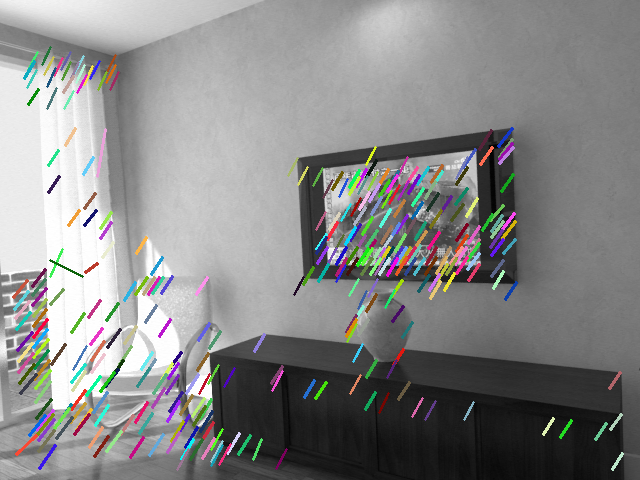

# C++ implementation of SuperPoint inference in LibTorch

This implements [SuperPoint: Self-Supervised Interest Point Detection and Description](https://doi.org/10.1109/CVPRW.2018.00060) in C++ using LibTorch and TorchScript.

| matches | tracks |
| :---: | :---: |
|  |  |

## Installation

This C++ implementation of SuperPoint requires [LibTorch](https://pytorch.org/cppdocs/installing.html). The following installation instructions will use [vcstool](http://wiki.ros.org/vcstool), [rosdep](http://wiki.ros.org/rosdep) and [colcon](https://colcon.readthedocs.io) for managing source and binary dependencies and to create a relocatable workspace.

1. CUDA and cuDNN:
    - add the [official CUDA Toolkit repo for Ubuntu](https://developer.nvidia.com/cuda-downloads?target_os=Linux&target_arch=x86_64&Distribution=Ubuntu)
    - install CUDA and cuDNN runtime `sudo apt install cuda-runtime-11-3 libcudnn8`

2. vcstool, rosdep and colcon:
    ```sh
    sudo pip3 install -U vcstool rosdep colcon-common-extensions
    sudo rosdep init
    rosdep update
    ```

3. create and compile the colcon workspace:
    ```sh
    # create workspace folder
    mkdir ~/super_point_ws/
    cd ~/super_point_ws/
    # download sources
    vcs import << EOF
    - git: {local-name: src/torch_cpp,             uri: "https://github.com/christian-rauch/torch_cpp.git"}
    - git: {local-name: src/super_point_inference, uri: "https://github.com/christian-rauch/super_point_inference.git"}
    EOF
    # resolve binary dependencies
    rosdep install --from-paths src --ignore-src -y
    # build workspace
    colcon build --cmake-args "-DCMAKE_BUILD_TYPE=Release"
    ```

The `torch_cpp` and `super_point_inference` packages will be installed to `~/super_point_ws/install/`. After sourcing the workspace via `source ~/super_point_ws/install/setup.bash` those packages will be discoverable by CMake.

## Keypoint Extraction and Matching Example

The `super_point_inference` contains the [original model and weights](https://github.com/magicleap/SuperPointPretrainedNetwork) converted via TorchScript and an example program to extract keypoints and find matches in a sequence of images. The converted model and weights are located at `~/super_point_ws/install/super_point_inference/share/weights/SuperPointNet.pt`. The example program `superpoint_match` takes the path to the converted model file and a list of image paths as argument:
```sh
# download example data
wget https://raw.githubusercontent.com/magicleap/SuperPointPretrainedNetwork/master/assets/icl_snippet/{250,254,258}.png -P /tmp/images/
# source the workspace
source ~/super_point_ws/install/setup.bash
# extract keypoints and matches
superpoint_match ~/super_point_ws/install/super_point_inference/share/weights/SuperPointNet.pt /tmp/images/{250,254,258}.png
```

The matches between consecutive image pairs will be shown in separate windows (press any key to close) and exported as `/tmp/matches-$PAIR.png` and `/tmp/tracks-$PAIR.png`.

## Citation

If you use the original work by Daniel DeTone et al., please cite their work:
```bibtex
@InProceedings{DeTone2018,
  author =    {DeTone, Daniel and Malisiewicz, Tomasz and Rabinovich, Andrew},
  title =     {SuperPoint: Self-Supervised Interest Point Detection and Description},
  booktitle = {Proceedings of the IEEE Conference on Computer Vision and Pattern Recognition (CVPR) Workshops},
  year =      {2018}
}
```

If you use this implementation, please cite our work:
```bibtex
@misc{Rauch2022,
  doi =       {10.48550/ARXIV.2204.11923},
  author =    {Rauch, Christian and Long, Ran and Ivan, Vladimir and Vijayakumar, Sethu},
  title =     {Sparse-Dense Motion Modelling and Tracking for Manipulation without Prior Object Models},
  publisher = {arXiv},
  year =      {2022},
}
```
